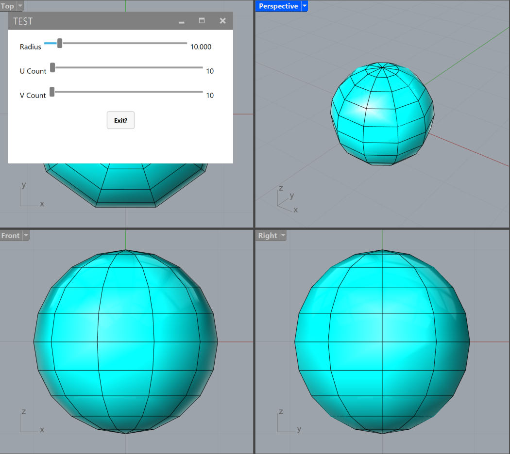
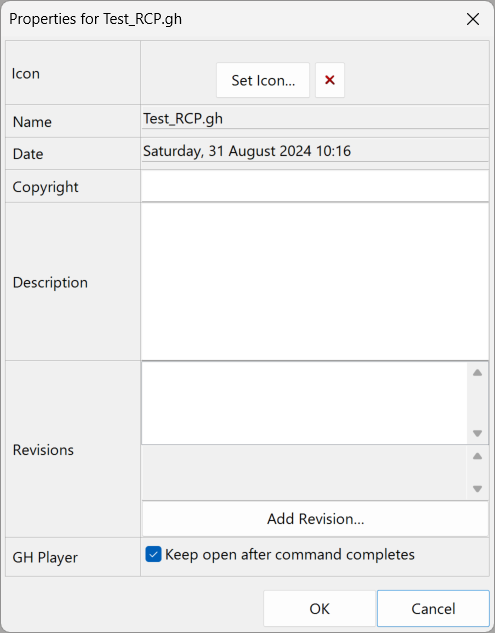
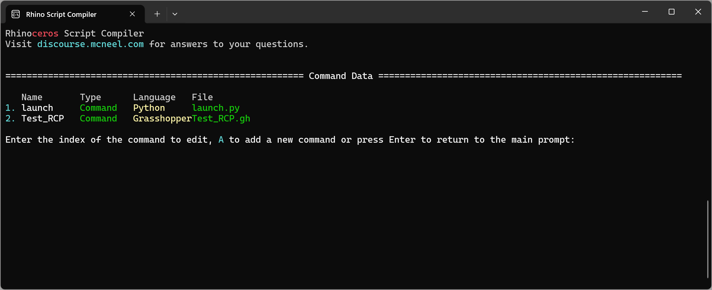

# GH definition to Rhino plugin (with interface)


This is an example  of how to wrap a Grasshopper definition as a Rhino plugin command, using [HumanUI](https://www.food4rhino.com/en/app/human-ui) to build an intuitive interface. You can use other plugins to build your UI, such as [UIPlus](https://www.food4rhino.com/en/app/ui) and/or [Synapse](https://www.food4rhino.com/en/app/synapse).

> [!WARNING]
> At the present moment (Rhino8 SR11, latest .NET version), HumanUI suffers from a conflict with UIPlus when they are installed together. If you intend to use HumanUI, do not install the other aforementioned UI plugins.

This pipeline is motivated by ease of use, implementation and maintaining of certain workflows on both user and developer’s sides.

The pipeline can be implemented in Rhino 7 (compiling with the Rhino Script Compiler) or Rhino 8 (compiling with the Rhino Script Compiler or using the new ScriptEditor). Note that the Rhino Script Compiler only allows Python scripts, Rhinoscript or Grasshopper (no C#).

The gist of it is to use a launch command (you can write it in Python or C#) to run a headless GH definition where you can setup the interface using your preferred UI plugin for GH (this example uses HumanUI). The launch command:

- launches GH (hiding the window and load process)
- shows the GH Remote Control Panel (RCP)
- runs the GH definition included in the plugin as a command

# Launch script

See `launchCS.cs` for a C# implementation and `launch.py` for a Python 3 implementation.

### C#

```csharp
#r "Grasshopper.dll"

using Rhino;
using Grasshopper;

// Load Grasshopper with no Banner
// Banner: Disable, Window: Show
RhinoApp.RunScript("-Grasshopper B D W S _Enter", false);

// Collapse GH Window to title bar
Grasshopper.Instances.DocumentEditor.CollapseForm();

// Window: Hide
RhinoApp.RunScript("-Grasshopper W H _Enter", false);

// Add the RCP to the current GH/Rhino
Grasshopper.Instances.ShowRemotePanel();

// Launch the Grasshopper Script Headless with GH Player
// Replace GHdefName with your definition name
// don't forget the space at the end
RhinoApp.RunScript("GHdefName ", true);
```

### Python

```python
#! python3
import rhinoscriptsyntax as rs
import Grasshopper as gh

# Disable command line echo
rs.Command("NoEcho")

# Load Grasshopper with no Banner
# Banner: Disable, Window: Show
rs.Command("-Grasshopper B D W S _Enter", echo=False)

# Collapse GH Window to title bar
gh.Instances.DocumentEditor.CollapseForm()

# Window: Hide
rs.Command("-Grasshopper W H _Enter", echo=False)

# Add the RCP to the current GH/Rhino
gh.Instances.ShowRemotePanel()

# Launch the Grasshopper Script Headless with GH Player
# Replace GHdefName with your definition name
# don't forget the space at the end
rs.Command("GHdefName ")
```

# GH definition

In File > Document Properties, tick the “Keep on after command completes” option:



- The GH definition must contain at least one of these GrasshopperPlayer components: `ContextBake` or `ContextPrint`
- Although the RCP must be called by the launcher command for the GH command to persist, it is not necessary to push anything to it (it can stay empty, as long as it shows up)
- The rest of the definition can be to your liking, using the HumanUI components to build an interface and interact with the model. See the included example for details.
>[!TIP]
> It is strongly suggested to include an “Exit” True Button that disables the previews and closes the UI window (otherwise previews stay persistent after you close the UI). See the included example for details.

# ScriptEditor (Rhino 8)

In Rhino8 type ScriptEditor, then:

- Create a new project (File > Create Project), save the project file and fill the project info:
    
    
    
    To edit these info later on, click on Publish project, make your changes and click on Save Changes.
    
- add project commands (.cs files, .py files, .gh definitions, etc.)
- compile the project and push it to Yak server (recommended)

Check the project file included as an example.

For more comprehensive step-by-step info, check the [Official Rhino Scripting Guides](https://developer.rhino3d.com/en/guides/scripting/).

# Script Compiler (Rhino 7-8)

- go to `C:\Program Files\Rhino 7\System` and double click on `RhinoScriptCompiler.exe`

or

- Hit the Windows key, type `CMD`, hit Enter and on the Command Prompt window that appears paste this:
    
    ```powershell
    "C:\Program Files\Rhino 7\System\RhinoScriptCompiler.exe"
    ```
    


Hit N to create a new project, give it a name, and choose a location to save it. A .rhc file will be created containing the project info.

Hit C to edit the Command settings and select all the files (Python, GH definitions) you want to turn into commands as part of the plugin:



You can set the other options (Plugin, Author, etc. by hitting the corresponding highlighted key):


For example, here are the Plugin settings:


When you’re ready, hit B to Build the project, and the compiler will produce a .rhp file and a .yak package. To distribute the .yak for the Package Manager, see the [Package Manager Guides](https://developer.rhino3d.com/guides/yak/).

# Test the example
Drag and drop the .rhp file (included in the src folder) into an open Rhino window, then type `launch`

---

# Acknowledgements & References

Many thanks to David Kay AKA [Kiteboardshaper](https://discourse.mcneel.com/u/kiteboardshaper) from the McNeel discourse forum, who first explored and refined this workflow. I merely retraced his steps, but I realize there were no consolidated examples for people who would like to do the same.

See [this thread](https://discourse.mcneel.com/t/offline-shapediver-style-service-packaging-app/126603) as a main reference for this example.

[Official Rhino Scripting Guides](https://developer.rhino3d.com/en/guides/scripting/)

[Package Manager Guides](https://developer.rhino3d.com/guides/yak/)

[Rhino Script Compiler tutorial by Steve Baer](https://vimeo.com/410409391)